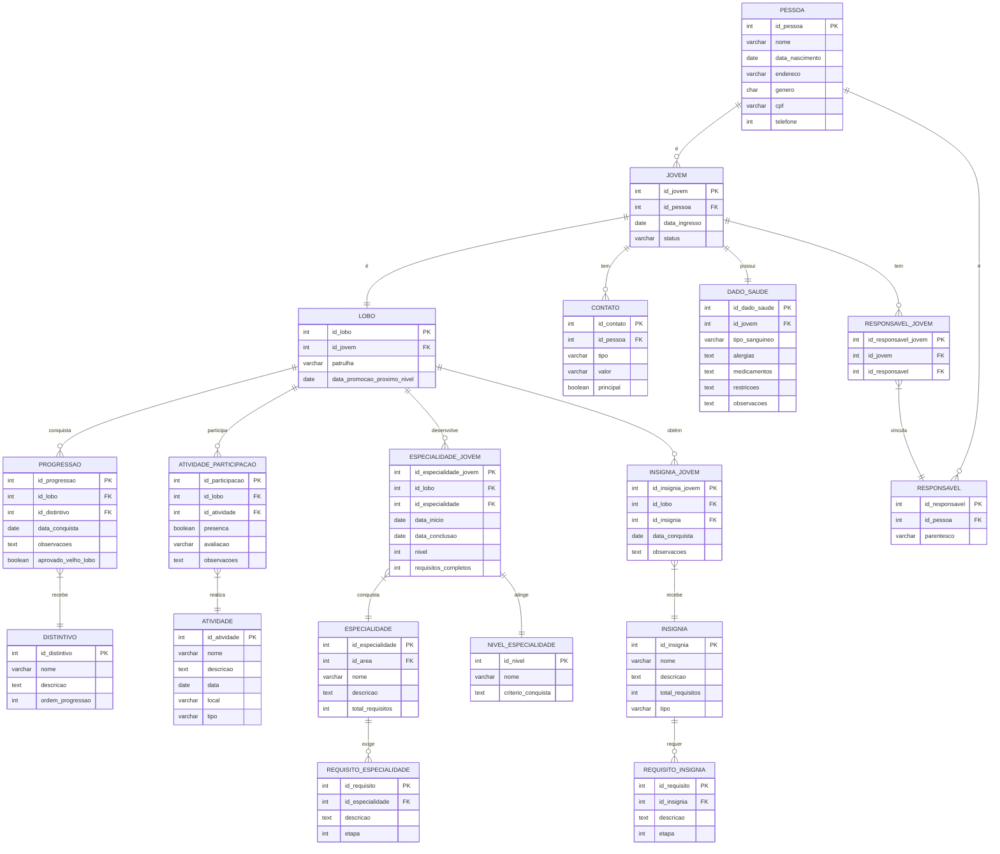

# Modelagem do Banco de Dados – Registro de Progressões no Movimento Escoteiro (Ramo Lobinho)

Este arquivo contém o diagrama Entidade-Relacionamento (ER) do banco de dados para o projeto de registro de progressões no ramo Lobinho, 
conforme solicitado na primeira entrega da disciplina de Banco de Dados.

O diagrama está modelado em terceira forma normal (3FN) e contempla as entidades principais, seus atributos e os relacionamentos entre eles, incluindo:

- Dados biográficos dos jovens (Lobinhos) e responsáveis
- Contatos e dados de saúde dos jovens
- Participação em atividades
- Especialidades, requisitos e níveis
- Distintivos, progressões e insígnias

## Diagrama ER

**Aluna:** Júlia Manuela Turnes
**Curso:** Análise e Desenvolvimento de Sistemas – IFSC
